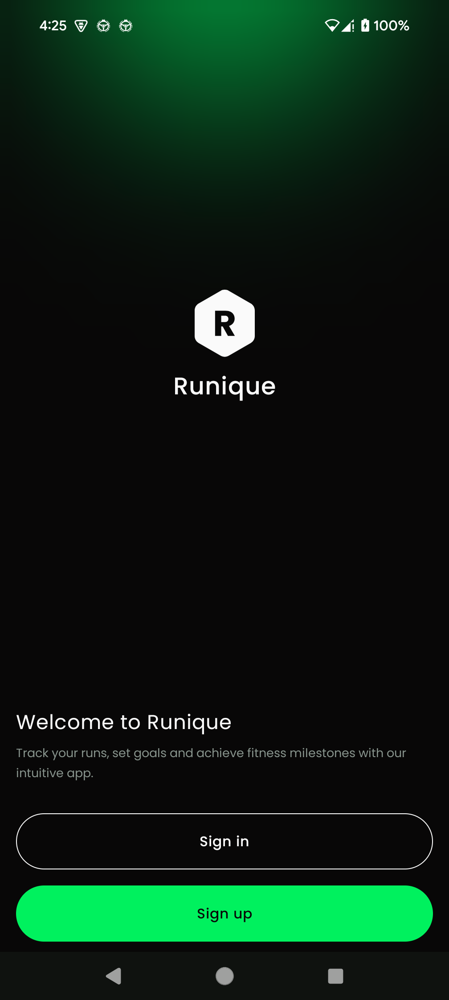
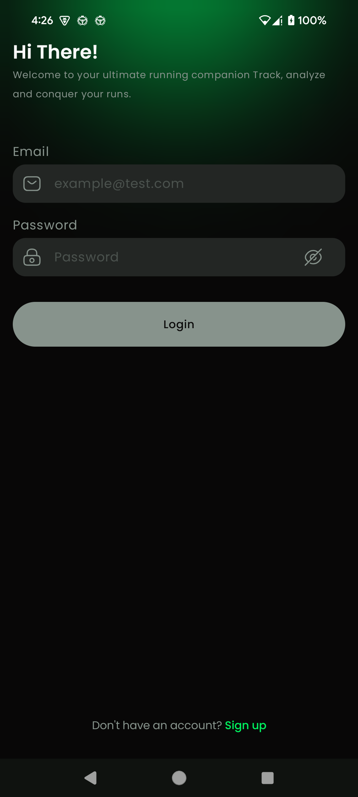
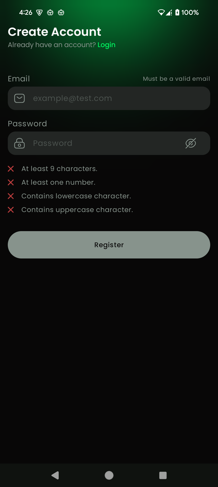
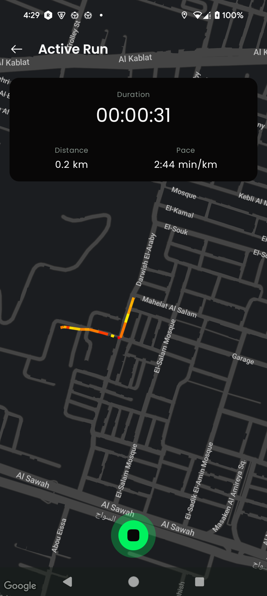
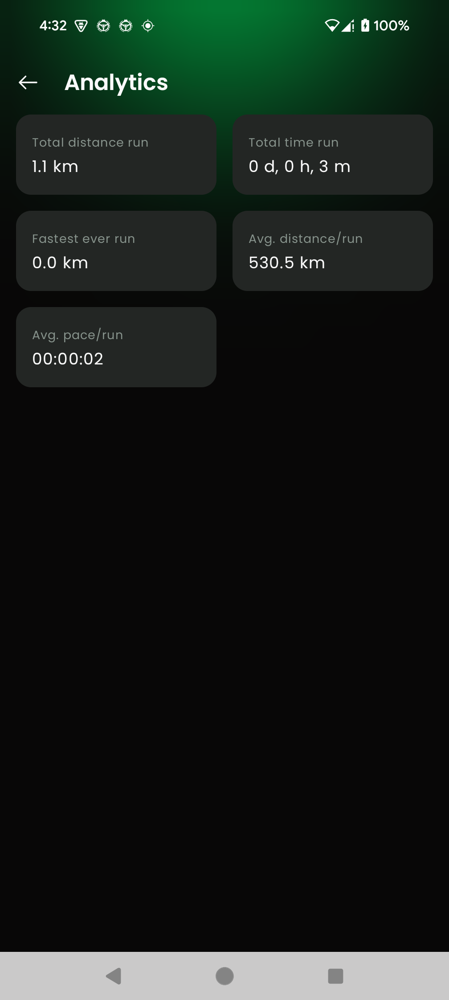

# Runique

Runique is a multi-module running tracker app designed to provide a seamless and intuitive way to
track and analyze your runs on your phone. With a focus on usability, it offers features to help you
gain insightful information about your running activities.

## Technologies Used

Runique leverages modern Android development tools and libraries, including:

- **Kotlin**: The primary language for app development.
- **Android Jetpack**: A suite of libraries to help with app architecture.
- **Multi-Module Project Structure**: For modularity and better scalability.
- **Jetpack Compose**: UI toolkit used in a multi-module setup.
- **Jetpack Navigation Compose**: For navigation between app screens.
- **Room**: Local database for storing run data.
- **Koin**: Dependency injection framework for modularization and flexibility.
- **Ktor**: Networking framework for API calls.
- **Google Maps SDK**: To display and track runs on a map.
- **Dynamic Feature Modules**: For on-demand feature delivery.
- **WorkManager**: For syncing and background tasks.

## Key Features

- **User Authentication**: Secure login and sign-up functionality.
- **Offline-First Development**: Continue tracking and viewing runs even without an internet
  connection.
- **Run Tracking**: Monitor your runs in real time.
- **Run History**: View past runs with detailed information.
- **Detailed Run Information**: Analyze metrics such as distance, time, pace, and more.
- **Map Integration**: See your runs plotted on a map.
- **Run Statistics**: Access analytics to measure and improve your performance."

## Screenshots

Below are screenshots of various app screens for reference:

<table>
  <tr>
    <td>
      
    </td>
    <td>
      
    </td>
  </tr>
  <tr>
    <td>
      
    </td>
    <td>
      
    </td>
  </tr>
  <tr>
    <td>
      
    </td>
    <td>
      
    </td>
  </tr>
</table>

## Installation

To get started with Runique:

1. [Download the APK](analytics_feature-debug.apk)
2. Install the app on your device.
3. Start tracking and analyzing your runs!