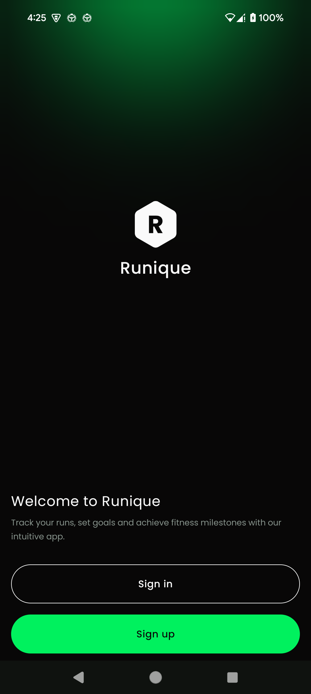
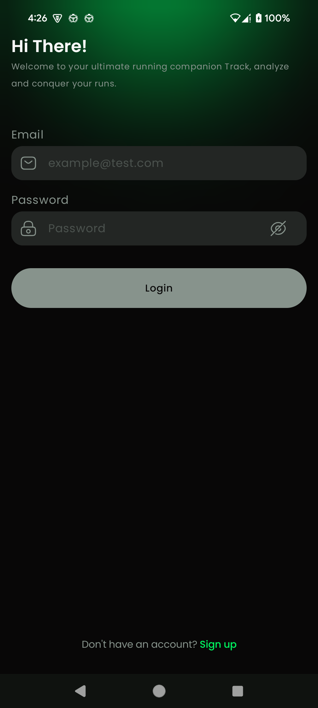
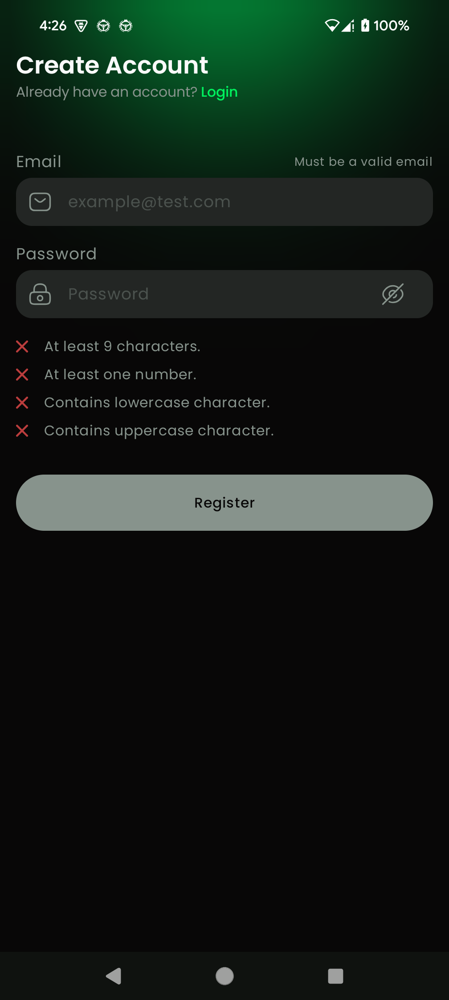
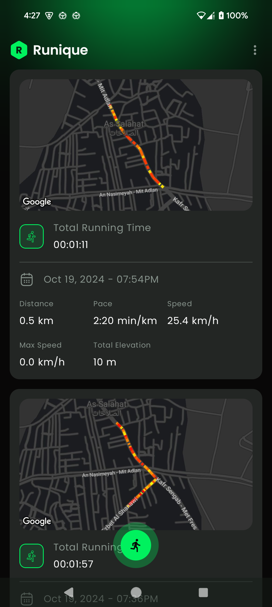
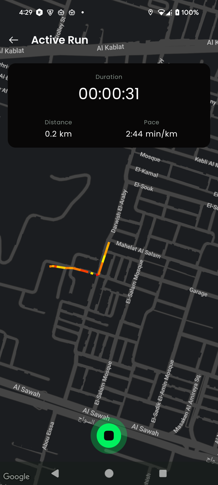
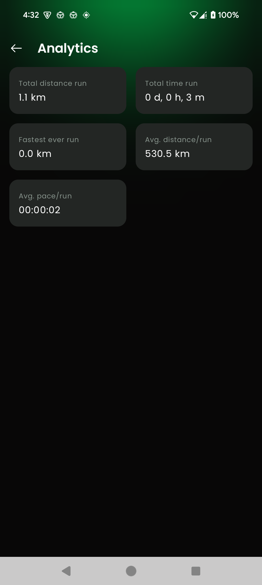

# Runique

Runique is a multi-module running tracker app for phones. It is designed to be a simple and easy to
use app that can track your runs and provide you with useful information about your runs.

## Technologies

Runique is built using the following technologies:

- Kotlin
- Android Jetpack
- Multi-module project
- Jetpack compose in multi-module project
- Jetpack navigation compose
- Room
- Koin
- Ktor
- Google Maps SDK

## Features
- Authentication (Login/Sign-up)
- Offline-first development
- Track your runs
- View your run history
- View detailed information about your runs
- View your run on a map
- View your run statistics

## Screenshots

<table>
  <tr>
    <td>
      
    </td>
    <td>
      
    </td>
  </tr>
</table>

 

## Installation

To install Runique, follow these steps:

1. Clone the repository
2. Open the project in Android Studio
3. Build and run the project
4. Enjoy!

